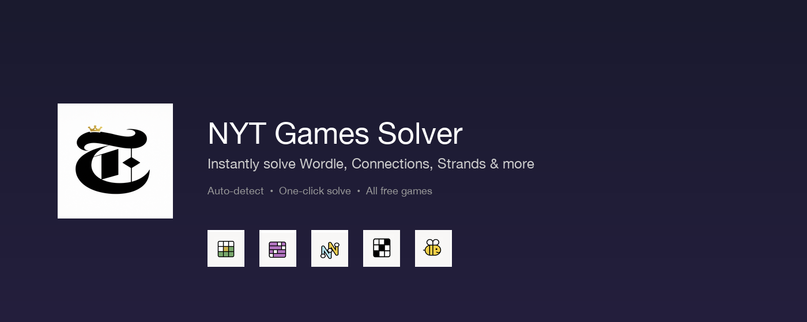

# NYT Games Solver

Chrome extension that instantly solves all NYT daily games — **Wordle**, **Connections**, **Strands**, **Mini Crossword**, and **Spelling Bee**.

Built with vanilla JavaScript. No frameworks, no AI, no server — just DOM parsing, React fiber traversal, and the Chrome Debugger Protocol.



## How it works

Each game has a dedicated solver that reads the answer from the game's own data (API responses, React fiber internals), finds the solution path, and enters it automatically.

| Game | Answer Source | Input Method |
|------|--------------|-------------|
| **Wordle** | React fiber state or Wordle API | Keyboard events (letter keys + Enter) |
| **Connections** | React fiber state or Connections API | Click word cards + Submit button |
| **Strands** | Performance API re-fetch or React fiber | Chrome Debugger Protocol (trusted mouse drag) |
| **Mini Crossword** | React fiber state or Crossword API | Click cell + keyboard letter input |
| **Spelling Bee** | React fiber state or embedded page data | Keyboard input + Enter to submit |

### Technical highlights

- **React Fiber traversal** — All solvers walk React's internal fiber tree to extract game state (solutions, categories, word lists), bypassing the need to reverse-engineer DOM structure
- **Chrome Debugger Protocol** — Strands requires trusted input events (drag gestures) that can't be faked with `dispatchEvent`. The background service worker attaches via `chrome.debugger` and dispatches `Input.dispatchMouseEvent` commands
- **Performance API interception** — Strands solver discovers the game's actual API endpoint by reading `performance.getEntriesByType('resource')`, then re-fetches the puzzle data with answers
- **Multi-frame injection** — Games may run inside iframes on different subdomains (`vi.nytimes.com`). Solvers are injected into all frames simultaneously, with results polled from any frame that finds the board
- **DFS word pathfinding** — Strands uses depth-first search with 8-directional adjacency to trace word paths through the letter grid, with global cell tracking to prevent overlap
- **Smart element detection** — Connections solver scans all DOM elements for exact text matches, checks `__reactProps` for click handlers, and simulates full pointer+mouse event sequences
- **Auto-detection** — If you're already on a game page, it starts solving the moment you open the popup

## Install (developer mode)

1. Clone this repo
2. Open `chrome://extensions`
3. Enable **Developer mode**
4. Click **Load unpacked** → select this folder
5. Navigate to any NYT game and click the extension icon

## Project structure

```
├── manifest.json          # Chrome extension manifest (v3)
├── background.js          # Service worker — CDP mouse events for Strands
├── popup/
│   ├── popup.html         # Extension popup UI
│   ├── popup.js           # Game selection, auto-detect, script injection
│   └── popup.css          # NYT-style UI
├── solvers/
│   ├── wordle.js          # 5-letter word solver via fiber/API
│   ├── connections.js     # Category grouping solver
│   ├── strands.js         # Word path solver with DFS + CDP drag
│   ├── mini-crossword.js  # Crossword grid filler
│   └── spelling-bee.js    # Word list entry solver
├── icons/                 # Extension icons and game icons
└── store-assets/          # Chrome Web Store promotional images
```

## Stack

- Vanilla JavaScript (no build step)
- Chrome Extension Manifest V3
- Chrome Debugger Protocol (CDP)
- Content script injection via `chrome.scripting`
